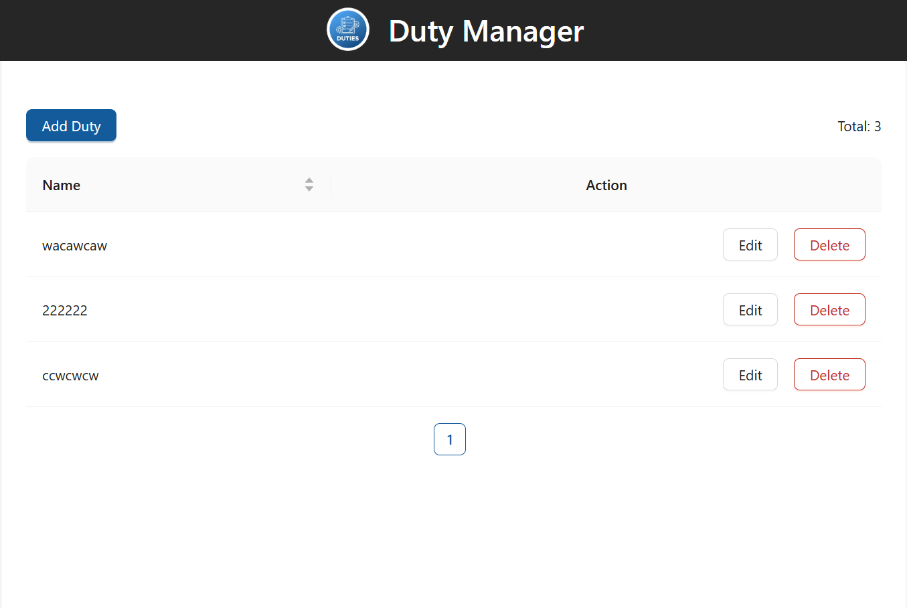
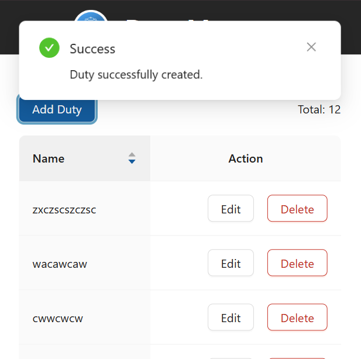

# Duty App Monorepo

This is the main README for the "Duty App" monorepo. It contains an architectural description, setup guides, and explanations of key features.

## Architecture

This project is a monorepo managed with **npm Workspaces** and orchestrated by **Turbo**. The structure is designed to separate frontend and backend responsibilities, allowing for independent development and deployment.

### Layered Architecture

The application follows a layered architecture pattern, promoting separation of concerns and maintainability. Each layer has a specific responsibility:

- **Presentation Layer (`apps/frontend`)**: Handles the user interface and user interactions. Built with React, TypeScript, and Ant Design.
- **Application Layer (`apps/backend/src/controllers` and `apps/backend/src/services`)**: Contains the business logic and orchestrates operations between the presentation and data layers.
- **Data Access Layer (`apps/backend/src/daos`)**: Responsible for interacting with the database, abstracting data storage details from the application layer.
- **Database (`PostgreSQL`)**: The persistent storage for the application data.

### Folder Structure

- **`apps/frontend`**: A Single Page Application (SPA) built with **Create React App (CRA)**. It uses React, TypeScript, and Ant Design for the user interface.
  - **`apps/frontend/src/components`**: Reusable UI components.
  - **`apps/frontend/src/hooks`**: Custom React hooks for encapsulating stateful logic.
  - **`apps/frontend/src/services`**: Frontend services for interacting with the backend API.
- **`apps/backend`**: An API server built with **Node.js** and **Express**. It uses TypeScript for type safety and connects to a **PostgreSQL** database for data persistence.
  - **`apps/backend/src/controllers`**: Handles incoming requests and sends responses.
  - **`apps/backend/src/services`**: Contains business logic and application services.
  - **`apps/backend/src/daos`**: Contains data access objects for interacting with the database.
- **`packages/*`**: A directory intended for shared packages (e.g., types, utilities) that can be used by both the frontend and the backend. (Currently not in use, but available for future expansion).

## Initial Setup

### Prerequisites

- Node.js (v20.x or higher)
- npm (v10.x or higher)
- A running PostgreSQL instance.

### 1. Install Dependencies

From the monorepo root, run:

```sh
npm install
```

This command will install all dependencies for both the `frontend` and `backend` applications, as well as any other `workspaces` defined in the monorepo.

### 2. Database Configuration

The backend requires a PostgreSQL database. Ensure your PostgreSQL instance is running and that the credentials in `apps/backend/src/db.ts` are correct.

### 3. Database Initialization

To create the `duties` table required for the application, run the following script from the monorepo root:

```sh
npm run db:setup
```

This command uses a custom script in the `scripts` workspace to initialize the database schema.

## Running the Project

### Development Mode

To start both the frontend and backend in development mode with hot-reloading, run from the monorepo root:

```sh
npm run dev
```

- The frontend will run on `http://localhost:3000`.
- The backend will run on `http://localhost:3001`.
- API calls from the frontend to `/api` will be redirected to the backend via CRA's development proxy.

### Production Mode

To simulate a production environment, run from the monorepo root:

```sh
npm run prod
```

This command performs two actions:

1.  **Builds** both the frontend and the backend for production.
2.  **Starts** both services. The frontend is served as static files on a port (e.g., `http://localhost:3000`) and the backend on `http://localhost:3001`. API calls are made using the absolute URL of the backend.

## Features and Implementation Details

### Progressive Web App (PWA)

The frontend application is configured as a Progressive Web App. This means it offers:

- **Offline Capabilities**: Content is cached by a Service Worker, allowing the app to function even without an internet connection.
- **Fast Loading**: Assets are served from cache for quicker repeat visits.
- **Installability**: Users can install the application directly to their device's home screen, providing an app-like experience without needing an app store.

### Pagination and Sorting

- **Pagination**: The duties table implements client-controlled pagination. The UI sends `page` and `limit` parameters in the API URL (e.g., `/api/duties?page=1&limit=10`). The backend uses these parameters to construct an SQL query with `LIMIT` and `OFFSET`, returning only the data for the requested page and the `total` number of records.
- **Sorting**: Currently, sorting is predefined in the backend to order duties by name in ascending order (`ORDER BY name ASC`). There are no UI controls to change the order.

### Caching Strategy

1.  **Service Worker Cache (Client-side)**: In production mode, Create React App configures a Service Worker (via Workbox) that caches all static assets of the application (JavaScript, CSS, images). This allows the application to load faster on subsequent visits and work offline.

2.  **API Cache (Client-side)**: The `apps/frontend/src/services/apiClient.ts` file implements a simple in-memory cache for `GET` requests. When a request is made, the response is stored in a `Map` with a timestamp. If the same request is repeated within 5 minutes, the cached response is returned instead of making a new network call.

3.  **Backend Cache (Server-side)**: The `apps/backend/src/cache.ts` file implements an in-memory cache on the server side. When a list of duties is requested, the backend first checks if the data is in its internal cache. If so, it returns the data directly, reducing the load on the database. The backend cache is automatically invalidated on any write operation (`POST`, `PUT`, `DELETE`).

### Testing

The project is configured for unit and integration tests in both workspaces:

- **Frontend**: Uses **Jest** and **React Testing Library**, which come pre-configured with Create React App. To run frontend tests, use:
  ```sh
  npm test --workspace=frontend
  ```
- **Backend**: Uses **Jest** and **ts-jest** to test API logic and the database. To run backend tests, use:
  ```sh
  npm test --workspace=backend
  ```
- **All Tests**: To run all tests in the monorepo, use from the root:
  ```sh
  npm test
  ```

### Monorepo Management (Turbo)

**Turbo** is used to optimize task execution across the monorepo. The `turbo.json` file defines tasks and their dependencies:

- **`build`**: Builds the applications. The `outputs` option tells Turbo which folders (`dist/`, `build/`) to cache.
- **`dev` and `start`**: Persistent tasks (`persistent: true`) that are not cached (`cache: false`).
- **`dependsOn`**: The `start` task depends on `build`, ensuring an application is built before attempting to start it.

### Screenshot





[ss.mp4](apps/frontend/public/screenshots/ss.mp4)